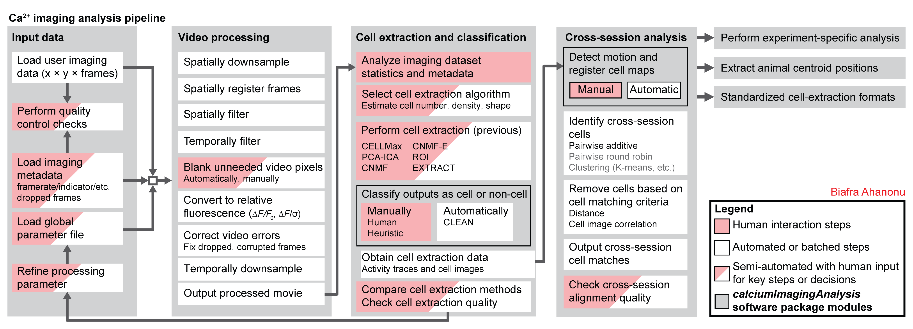

# {{ site.name }}
 <!-- (calciumImagingAnalysis [`CIAPKG`]) -->

Created by __Biafra Ahanonu, PhD__.

`{{ site.name }}` (pronounced cheetah, formerly `calciumImagingAnalysis` [`CIAPKG`]) is a software package for analysis of one- and two-photon calcium imaging datasets.

Currently requires `MATLAB` and runs on all major operating systems (Windows, Linux [e.g. Ubuntu], and macOS).

__Download the software at [https://github.com/bahanonu/ciatah](https://github.com/bahanonu/ciatah).__

- Note: `CIAtah` version `v4` moves the remaining (i.e. all except external packages/software) CIAtah functions into the `ciapkg` package to improve namespace handling and requires MATLAB R2019b or above ([due to package import changes](https://www.mathworks.com/help/matlab/matlab_prog/upgrade-code-for-r2019b-changes-to-function-precedence-order.html#mw_2934c766-e115-4d22-9abf-eb46a1415f2c)). Users with earlier versions of MATLAB can download `CIAtah` version `v3` (see [Releases](https://github.com/bahanonu/ciatah/releases)) until pre-R2019b MATLAB support is fully integrated into v4.

- This user guide contains instructions to setup, run, and troubleshoot `{{ site.name }}`.
- Note: `{{ site.name }}` is a class (`{{ site.namelow }}` within MATLAB) with various GUIs to allow processing of calcium imaging data. In addition, users can access the underlying `{{ site.name }}` functions to make custom workflows. See [Custom command-line pipelines](api_example_pipeline.md).

## Guides

Below are recordings for users who want to learn more about calcium imaging analysis.

- Read my overview of calcium imaging analysis methods at [Calcium imaging cell identification and fluorescence activity trace reconstruction, part 1](https://bahanonu.com/brain/#c20181209).

### Webinar
This webinar gives an overview of calcium imaging analysis (with a focus on CIAtah) along with tips for improving experiments and analysis: https://info.inscopix.com/inscopix-inspire-view-webinarbiafra-ahanonu-signal-in-the-noise-distinguishing-relevant-neural-activity-in-calcium-imaging.

### Workshop tutorial
This recording gives an overview of setting up and using CIAtah: https://www.youtube.com/watch?v=I6abW3uuJJw.

<!-- 
 -->

<strong>Movie processing, cell extraction, and analysis validation.</strong>

  <strong>{{ site.name }} cell sorting GUI</strong>

  

  <strong>Stable cell alignment across imaging sessions.</strong>

  

`{{ site.name }}` features:

- A GUI with different modules for large-scale batch analysis.
- `CIAtah` functions (in `ciapkg`/`+ciapkg` folders) can be used to create GUI-less, command line-ready analysis pipelines.
- Includes all major calcium imaging analysis steps:
  - movie visualization (including reading from disk, for fast viewing of large movies)
  - pre-processing (motion correction, spatiotemporal downsampling, spatial filtering, relative fluorescence calculation, etc.)
  - support for multiple cell-extraction methods (CELLMax, PCA-ICA, <a href='https://github.com/flatironinstitute/CaImAn-MATLAB' target='_blank'>CNMF</a>, CNMF-E, <a href='https://github.com/schnitzer-lab/EXTRACT-public' target='_blank'>EXTRACT</a>, etc.)
  - manual classification of cells via GUIs,
  - automated cell classification (i.e. CLEAN algorithm, coming soon!),
  - cross-session cell alignment, and more.
- Includes example one- and two-photon calcium imaging datasets for testing `ciatah`.
- Supports a plethora of major imaging movie file formats: HDF5, NWB, AVI, ISXD [Inscopix], TIFF, and [Bio-Formats](https://www.openmicroscopy.org/bio-formats/) compatible formats (Olympus [OIR] and Zeiss [CZI and LSM] currently, additional support to be added or upon request).
- Supports [Neurodata Without Borders](https://www.nwb.org/) data standard (see [calcium imaging tutorial](https://neurodatawithoutborders.github.io/matnwb/tutorials/html/ophys.html)) for reading/writing cell-extraction and imaging movie files.
- Animal position tracking (e.g. in open-field assay).
- Requires `MATLAB`.

## Navigation

The main sections of the site:

- `Setup` - installation of `{{ site.name }}`.
- `Repository` - notes about the software package and data formats.
- `Processing data` - sections related to processing calcium imaging movies using the `{{ site.name }}` class.
- `API` - details how to run `{{ site.name }}` from the command line. Will include more details on the many underlying functions in the future.
- `Help` - several section that provide hints and help for processing calcium imaging.
- `Misc` - miscellaneous information about the repository.

## References

Please cite our [Corder*, Ahanonu*, et al. _Science_, 2019](http://science.sciencemag.org/content/363/6424/276.full) publication if you used the software package or code from this repository to advance or help your research.

## Questions?

Please [open an issue on GitHub](https://github.com/bahanonu/calciumImagingAnalysis/issues) or email any additional questions not covered in the repository to `bahanonu [at] alum.mit.edu`.

Made in USA. 

-  (starting 2020.09.16)
-  (starting 2020.09.22)
<!-- -  (starting 2020.08.16), frozen til `dwyl` migrates to new server. -->