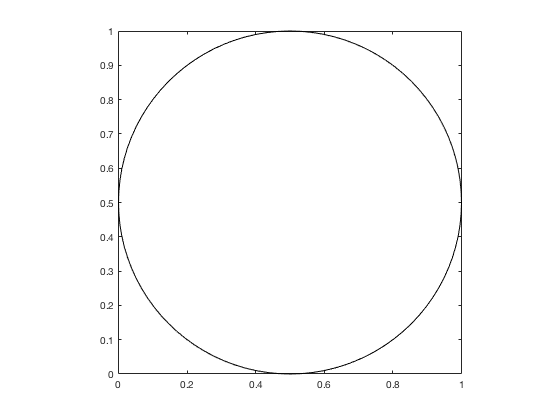
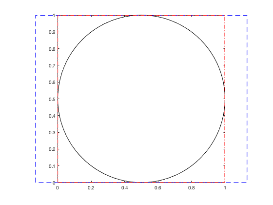

# plotboxpos.m: Plot box (visible) position


Author: Kelly Kearney


This repository includes the code for the `plotboxpos.m` Matlab function.


This function returns the position of the plotted region of an axis, which may differ from the actual axis position, depending on the axis limits, data aspect ratio, and plot box aspect ratio.  The position is returned in the same units as the those used to define the axis itself. This function can only be used for a 2D plot.


## Contents


- Getting started        
- Syntax        
- Examples        
- Contributions

## Getting started


**Prerequisites**


This function requires Matlab R14 or later.


**Downloading and installation**


This code can be downloaded from [Github](https://github.com/kakearney/plotboxpos-pkg/) or the [MatlabCentral File Exchange](http://www.mathworks.com/matlabcentral/fileexchange/9615-plotboxpos).  The File Exchange entry is updated daily from the GitHub repository.


**Matlab Search Path**


The following folders need to be added to your Matlab Search path (via `addpath`, `pathtool`, etc.):


```matlab
plotboxpos-pkg/plotboxpos
```


## Syntax


`pos = plotboxpos(h)` returns the 1 x 4 position vector `pos` for the axis with handle `h`.  The units of `pos` will match those of the axis' parent object (typically the figure).


## Examples


We start by plotting a circle, changing the axis aspect ratio to be 1:1 and the axis limits to be tight to the data.


```matlab
h.ax(1) = axes;
h.ex = rectangle('position', [0 0 1 1], 'curvature', [1 1]);
axis tight equal;
box on;
```




The axis `'Position'` property still corresponds to the full potential axis space, discounting the axis modifications we just made.


```matlab
pos1 = get(h.ax(1), 'position');
annotation('rectangle', pos1, 'edgecolor', 'b', 'linestyle', '--');
```


The `plotboxpos` function returns the position the axis is actually using with its current axis ratio settings;


```matlab
pos2 = plotboxpos(h.ax(1));
annotation('rectangle', pos2, 'edgecolor', 'r', 'linestyle', '-.');
```





## Contributions


Community contributions to this package are welcome!


To report bugs, please submit [an issue](https://github.com/kakearney/plotboxpos-pkg/issues) on GitHub and include:


- your operating system
- your version of Matlab and all relevant toolboxes (type `ver` at the Matlab command line to get this info)
- code/data to reproduce the error or buggy behavior, and the full text of any error messages received

Please also feel free to submit enhancement requests, or to send pull requests (via GitHub) for bug fixes or new features.


I do monitor the MatlabCentral FileExchange entry for any issues raised in the comments, but would prefer to track issues on GitHub.


<sub>[Published with MATLAB R2016b]("http://www.mathworks.com/products/matlab/")</sub>
